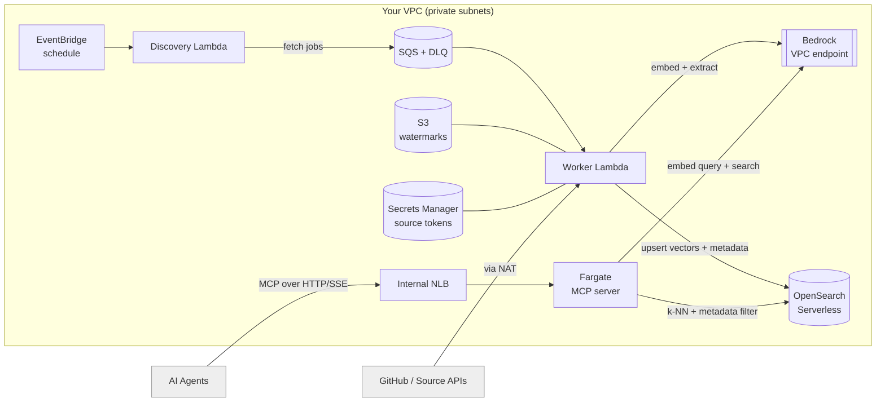
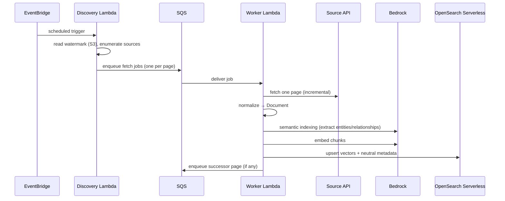

# Architecture

Aquifer.ai is an **in-VPC Context Lake**: infrastructure that aggregates engineering context
into a vector store and serves it to AI agents over a standard MCP API. It is deployed as a
**single AWS CDK (Python) stack** and runs entirely inside your own VPC against your own Amazon
Bedrock. It is not a SaaS — there is no external control plane and no data leaves your account.

This document describes the deployed architecture and the rationale behind it. It is written for
platform engineers and architects evaluating or operating Aquifer.

## High-level architecture

  

The diagram below is the source-of-truth schematic; the rendered version above mirrors it.

Every component is provisioned by one stack and lives in private subnets. Bedrock, OpenSearch,
SQS, Secrets Manager, and S3 are reached over VPC/PrivateLink endpoints; only outbound source
fetches (e.g. GitHub) traverse a NAT gateway. The MCP load balancer is **internal** — agents
must run inside the VPC or a peered network.

## Stack composition

The stack (`infrastructure/aquifer_stack.py`) composes four constructs:

| Construct (`infrastructure/components/`) | Responsibility | Key AWS resources |
| --- | --- | --- |
| `network.py` | Private networking and egress control | VPC, NAT, interface endpoints (Bedrock, Secrets Manager, SQS), S3 gateway endpoint |
| `vector_store.py` | Neutral knowledge store | OpenSearch Serverless collection + VPC endpoint + encryption/network/data-access policies |
| `ingestion.py` | Pull + index pipeline | Discovery & Worker Lambdas, EventBridge rule, SQS (+DLQ), S3 (watermarks), Secrets Manager |
| `mcp_service.py` | Retrieval API | Fargate service + task role, internal Network Load Balancer |

## The pipeline

1. **Source → Document.** A `Connector` (e.g. GitHub) fetches issues, PRs, and READMEs one
   bounded page at a time and normalizes them into a source-agnostic `Document`. Pagination is
   fanned out through SQS so a full backfill is simply many short Lambda invocations — no job
   ever approaches the Lambda timeout.
2. **Semantic Indexing (Bedrock).** In the `before_ingest` hook, the semantic indexer calls a
   Claude model on your Bedrock to extract **neutral, objective** metadata — typed entities
   (`service:billing-api`, `jira_key:PROJ-400`), factual relationships (`depends_on`,
   `references`, `part_of`), and topics. See [concepts.md](./concepts.md).
3. **Embedding + storage.** Chunks are embedded with Amazon Titan and upserted into OpenSearch
   Serverless. The extracted metadata is denormalized onto every chunk and indexed as queryable
   fields (structured objects plus flattened keyword arrays for efficient filtering).
4. **MCP API.** A persistent Fargate service exposes the lake over the Model Context Protocol.
   Agents call neutral retrieval tools — `search_context`, `get_document`, `list_sources`,
   `find_related`, `list_entities` — to gather exactly the context they need.

## Design rationale

**Modularity.** Every layer depends on a narrow interface, not a concrete implementation:
`Connector`, `Embedder`, `VectorStore`, `Inferencer`, `SemanticIndexer`, and `Interceptor`
(in `aquifer/core/interfaces.py`). Concrete adapters are selected at the edges via
`aquifer/ingestion/factory.py`. Adding a source, swapping the vector store, or changing the
embedding provider is a localized change — see [contributing.md](./contributing.md).

**Neutrality.** The engine extracts facts; it never draws conclusions, assigns risk, or returns
verdicts. This keeps Aquifer a trustworthy source of truth and leaves reasoning where it
belongs — in the agent. Neutrality is a hard architectural constraint, not a default.

**Security and sovereignty.** All processing — including model inference — happens inside your
VPC against your own Bedrock. There is no external API, no telemetry, and no vendor lock-in. The
MCP endpoint is internal-only; source credentials live in Secrets Manager; the OpenSearch
collection is reachable solely through its VPC endpoint.

**Right-sized compute.** Ingestion is bursty and IO-bound, so it runs on Lambda (serverless,
SQS-fanned). The MCP API holds long-lived agent connections, so it runs on Fargate. One stack,
two compute models, each matched to its workload.

## The extension seam

Cross-cutting enterprise concerns (SSO, RBAC, audit) are intentionally **absent** from the
open-source core. The core exposes an `Interceptor` seam (`before/after_ingest`,
`before/after_query`, `authorize`) with pass-through defaults. Enterprise capabilities ship as a
separate package that registers interceptors via configuration — the core never imports
enterprise code.

---

**Support.** For commercial inquiries, professional advisory, or deployment support, contact
**[Senora.dev/contact](https://Senora.dev/contact)**. Aquifer.ai is an infrastructure layer you
run yourself, not a managed service.
