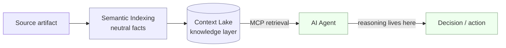
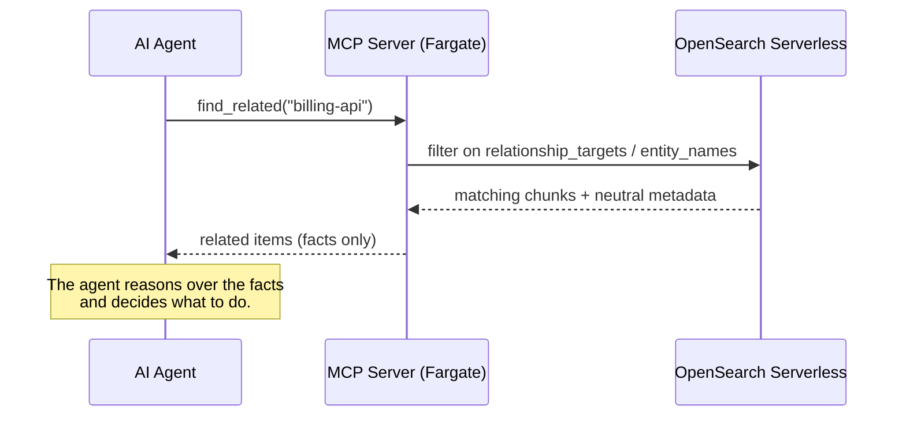

# Core Concepts

This document defines the vocabulary and principles behind Aquifer.ai so that operators and
contributors share a precise mental model. The terms here are load-bearing: they constrain what
Aquifer does — and, just as importantly, what it deliberately does not do.

## Context Lake

A **Context Lake** is a *knowledge layer*, not a database. A database answers structural queries
over rows you wrote; a Context Lake answers *contextual* queries over heterogeneous engineering
artifacts you ingested — code, issues, tickets, docs — unified into a single retrievable surface.

Concretely, the Context Lake combines:

- **Vector search** over the text of every artifact (semantic similarity), and
- **A neutral metadata graph** of objective entities and relationships extracted at ingestion.

Agents query it by meaning and by fact (e.g. "everything related to `billing-api`"), without
knowing which source system each artifact came from. The lake organizes context; it does not own
the source of record and does not replace your databases.

## Semantic Indexing

**Semantic Indexing** is the automated, ingestion-time extraction of **objective, structured
metadata** from each artifact, performed by a generative model on your own Bedrock. For every
document it produces:

- **Entities** — typed, canonical references: `{"type": "service", "name": "billing-api"}`,
  `{"type": "jira_key", "name": "PROJ-400"}`.
- **Relationships** — factual edges between entities: `depends_on`, `references`, `part_of`,
  `modifies`, `mentions`.
- **Topics** — short objective keywords.
- **Summary** — a neutral, factual description.

Indexing runs in the `before_ingest` hook, so metadata is computed once, at write time, and
stored alongside the vectors. Agents retrieve pre-extracted facts directly — there is no
per-query inference and no inference latency on the read path. Extraction is governed by a
**modular prompt registry** keyed by source and artifact type, so each input (a GitHub PR, a Jira
task) is read with the right lens.

## Neutrality Principle

Aquifer extracts **facts, never verdicts**. It will record that a pull request `depends_on redis`
and `modifies billing-api`; it will *not* decide whether the change is risky, whether you may
deploy, or how to prioritize it. There are no severities, scores, recommendations, or guardrail
conclusions anywhere in the engine.

This is a deliberate architectural boundary:

- **Trust.** Neutral, auditable facts are reusable by any agent and any policy. Embedded
  judgments are opinions that age badly and quietly bias every downstream decision.
- **Separation of concerns.** Reasoning is the agent's job. Aquifer is the retrieval substrate
  that makes that reasoning well-informed.
- **Composability.** Because the lake takes no positions, organizations layer their own policy
  and reasoning on top without fighting the infrastructure.

> If a proposed feature outputs a judgment, score, or "should/should-not," it does not belong in
> the engine. It belongs in the agent.

## MCP Integration

Agents interact with the Context Lake exclusively through the **Model Context Protocol (MCP)**,
served by a persistent Fargate process inside your VPC. The API surface is a small set of
neutral retrieval tools:

| Tool | Purpose |
| --- | --- |
| `search_context(query, k?, filters?)` | Semantic (k-NN) search with optional metadata filters |
| `get_document(document_id)` | Retrieve a full document, chunks reassembled in order |
| `list_sources()` | List the configured sources |
| `find_related(entity, relationship_types?)` | Retrieve items linked to an entity (graph traversal) |
| `list_entities(document_id?, entity_type?)` | Return a neutral inventory of extracted entities |

The tools return organized context — text, source links, entities, and relationships. What that
context *means* for a given task is determined entirely by the agent.

---

**Support.** For commercial inquiries, professional advisory, or support, contact
**[Senora.dev/contact](https://Senora.dev/contact)**. Aquifer.ai is infrastructure you operate in
your own VPC, not a SaaS.
