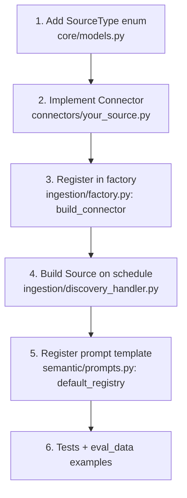

# Contributing

Aquifer.ai is built to be extended without forking the core. This guide explains the modular
registry/interceptor pattern and walks through the two most common extensions: adding a new
**source connector** and adding an **interceptor**.

Two rules govern every contribution:

1. **Neutrality.** Connectors and prompts extract *objective facts only* — entities,
   relationships, keys. No judgments, scores, severities, or verdicts. See
   [concepts.md](./concepts.md#neutrality-principle).
2. **Lean core.** The core depends on interfaces, never on concrete adapters or enterprise code.

## The interfaces

All extension points are abstract interfaces in `aquifer/core/interfaces.py`:

| Interface | Responsibility |
| --- | --- |
| `Connector` | Pull from a source and normalize to `Document` |
| `Embedder` | Text → vector |
| `VectorStore` | Persist and search chunks + metadata |
| `Inferencer` | Structured-output LLM client |
| `SemanticIndexer` | Extract neutral `SemanticMetadata` from a `Document` |
| `Interceptor` | Cross-cutting hooks (`before/after_ingest`, `before/after_query`, `authorize`) |

Concrete implementations are wired at the edges in `aquifer/ingestion/factory.py`. The core never
imports them directly.

## Adding a new SourceType / Connector



**1. Declare the source type.** Add a member to `SourceType` in `aquifer/core/models.py`
(e.g. `CONFLUENCE = "confluence"`).

**2. Implement the connector.** Create `aquifer/connectors/your_source.py` implementing
`Connector`:

```python
class YourConnector(Connector):
    source_type = SourceType.CONFLUENCE.value

    def discover(self, source: Source) -> Iterable[FetchJob]:
        # enumerate the initial fetch jobs (one per space/kind, etc.)
        ...

    def fetch(self, job: FetchJob) -> tuple[list[Document], FetchJob | None]:
        # fetch ONE bounded page; normalize to Document; return a successor job or None
        ...
```

Keep connectors **pure and AWS-free** (use an injectable HTTP client) so they are unit-testable
without network or cloud access — follow `aquifer/connectors/github.py` as the reference.
Normalize each item with `Document.make_id(...)` and an appropriate `DocumentKind`.

**3. Register it in the factory.** Add a branch to `build_connector` in
`aquifer/ingestion/factory.py` mapping your `SourceType` to the connector.

**4. Make discovery create the Source.** Extend `_build_sources` in
`aquifer/ingestion/discovery_handler.py` so the scheduled Discovery Lambda constructs a `Source`
for the new type (with its config and incremental watermark).

**5. Register a semantic prompt.** Add a `PromptTemplate` in `aquifer/semantic/prompts.py` via
`default_registry()`, keyed by `(source_type, kind)` or at the source level. The registry
resolves with graceful fallback (exact → per-source → generic), so a single source-level template
is enough to start. Keep the instructions strictly neutral (extract facts, not verdicts).

**6. Add tests and golden examples.** Add fixture-based connector tests under `tests/` and, to
tune extraction, drop a few `*.json` artifacts into `tests/eval_data/` for the eval harness.

No changes to chunking, embedding, the vector store, or the MCP tools are required — they operate
on the source-agnostic `Document`/`Chunk` model.

## Adding an Interceptor

Interceptors are the seam for cross-cutting behavior (e.g. redaction, tenant scoping, and — in
enterprise builds — RBAC and audit). They are loaded by dotted path from configuration, so the
core never imports them.

```python
from aquifer.core.interfaces import Interceptor

class TenantScopeInterceptor(Interceptor):
    def before_query(self, ctx):
        ctx.filters = {**ctx.filters, "repo": _tenant_repos(ctx.principal)}
        return ctx
```

Register it via the `AQUIFER_INTERCEPTORS` environment variable (a JSON array of
`"module:Class"` paths). They run in order; `authorize` is deny-overrides. The semantic indexer
itself is just an interceptor — see `aquifer/semantic/interceptor.py` for a complete example.

## Development workflow

```bash
pip install -e ".[dev]"
pytest                                   # unit + fixture tests (no AWS required)
ruff check src/aquifer tests scripts     # lint
python scripts/eval_semantic_index.py    # tune extraction prompts (calls your Bedrock)
cd infrastructure && cdk synth           # validate the stack
```

Please ensure `pytest` and `ruff` pass, and that new behavior is covered by tests that run
offline (use injected fakes for AWS/LLM clients, as the existing tests do).

## Licensing

Aquifer.ai is distributed under the Business Source License 1.1 (see `LICENSE` and
`LICENSE_TERMS.md`). By contributing you agree your contributions are licensed under the same
terms.

---

**Support.** For commercial inquiries, professional advisory, or partnership discussions, contact
**[Senora.dev/contact](https://Senora.dev/contact)**. Aquifer.ai is an infrastructure layer you
run in your own VPC, not a SaaS.
