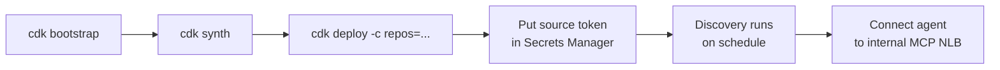

# Getting Started

This guide walks a platform engineer through deploying the Aquifer.ai stack into an AWS account.
Aquifer runs entirely in your VPC against your own Amazon Bedrock — you are deploying
infrastructure you own and operate, not signing up for a service.

## Prerequisites

| Requirement | Notes |
| --- | --- |
| **AWS account + credentials** | Permissions to create VPC, OpenSearch Serverless, Lambda, ECS/Fargate, SQS, S3, Secrets Manager, IAM. Configure with `aws configure`. |
| **AWS CLI v2** | Used for credentials and post-deploy steps. |
| **Node.js 20 or 22** | Required by the AWS CDK Toolkit CLI. |
| **Python 3.11+** | Runtime for the CDK app and the package. |
| **Docker (running)** | CDK bundles the Lambda code and builds the MCP image locally at deploy time. |
| **Amazon Bedrock model access** | Enable the embedding model (Titan Text Embeddings v2) and the inference model (a Claude model) in your target region. |

## 1. Install

```bash
git clone <your-fork-or-mirror> aquifer && cd aquifer
python -m venv .venv && source .venv/bin/activate
pip install -e ".[dev,cdk]"        # package + tooling + CDK libraries
npm install -g aws-cdk             # or use: npx cdk ...
```

Verify the toolchain:

```bash
cdk --version
python -c "import aws_cdk; print('cdk libs OK')"
```

## 2. Bootstrap the environment

CDK needs a one-time bootstrap per account/region:

```bash
export CDK_DEFAULT_ACCOUNT=$(aws sts get-caller-identity --query Account --output text)
export CDK_DEFAULT_REGION=us-east-1     # your target region
cd infrastructure
cdk bootstrap
```

## 3. Review configuration

Deploy-time configuration is passed as CDK context; runtime configuration is injected as
`AQUIFER_*` environment variables by the stack. The most common context keys:

| Context key | Default | Purpose |
| --- | --- | --- |
| `repos` | `[]` | JSON array of GitHub `org/repo` entries to ingest |
| `index` | `aquifer-context` | OpenSearch index name |
| `model_id` | `amazon.titan-embed-text-v2:0` | Embedding model id |

Runtime settings (region, semantic-indexing model, chunk sizes, etc.) have sensible defaults and
can be overridden via environment variables on the Lambda/Fargate tasks; see
`aquifer/core/config.py`.

## 4. Deploy



```bash
# from infrastructure/
cdk synth                                   # optional: inspect the template
cdk deploy -c repos='["your-org/your-repo"]'
```

Deploying builds the Lambda bundle and the MCP container image (Docker must be running) and
provisions the full stack. On completion, CloudFormation prints these outputs:

- `McpEndpoint` — internal NLB DNS for the MCP API (reachable only inside the VPC)
- `CollectionEndpoint` — OpenSearch Serverless endpoint
- `IngestQueueUrl` — the ingestion SQS queue
- `GitHubTokenSecretArn` — the Secrets Manager secret to populate next

## 5. Provide the source credential

Store your GitHub token (a fine-grained PAT with read access to the target repos) in the created
secret:

```bash
aws secretsmanager put-secret-value \
  --secret-id <GitHubTokenSecretArn> \
  --secret-string 'ghp_xxxxxxxxxxxxxxxxxxxx'
```

## 6. Run ingestion

The Discovery Lambda runs on a schedule (every 15 minutes by default). To start immediately,
invoke it once:

```bash
aws lambda invoke --function-name <AquiferStack-IngestionDiscovery...> /dev/stdout
```

It enumerates the configured repositories, fans fetch jobs onto SQS, and the Worker Lambda
performs semantic indexing, embedding, and upsert into OpenSearch.

## 7. Connect an agent

The MCP API is exposed on an **internal** load balancer. Point an MCP-capable agent running
inside the VPC (or a peered/VPN-connected network) at the `McpEndpoint` over HTTP/SSE. The agent
can then call `search_context`, `find_related`, `list_entities`, and the other tools described in
[concepts.md](./concepts.md).

## 8. Tear down

```bash
cd infrastructure
cdk destroy
```

## Troubleshooting

- **Docker errors during deploy** — ensure the Docker daemon is running; CDK bundles assets in
  containers.
- **`AccessDeniedException` from Bedrock** — enable model access for both the embedding and
  inference models in your region.
- **No results from the MCP API** — confirm the secret is populated and that the Worker Lambda
  has run (check its logs and the SQS/DLQ depth).

---

**Support.** For deployment assistance, professional advisory, or commercial inquiries, contact
**[Senora.dev/contact](https://Senora.dev/contact)**.
